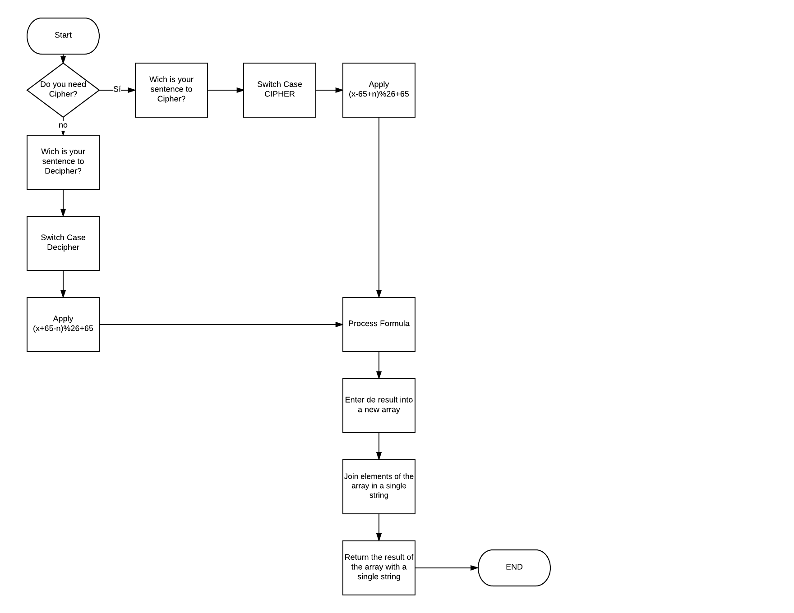

# Pseudocódigo

1.- Create two functions that cipher o decipher a sentence
2.- Solicitar al usuario si desea cifrar o decifrar
3.- Identificar si se va cifrar o decifrar y entrar a un switch de acuerdo al caso.
	3.1 El switch tendrá 2 casos: CIPHER y DECIPHER más una opción por default indicando que debe ingresar una frase.
4.- Si el usuario ingresa CIPHER o DECIPHER validar la respuesta y ¿preguntar cuál es la frase?
5.- Ingresar la frase a la función correspondiente.
6.- Revisar letra por letra cual es su posición en el alfabeto y una vez ubicada buscar la posición de la letra en el código ASCII.
7.- Utilizar la fórmula de Caesar Cipher:
	7.1 Para CIPHER (x-65+n)%26+65
	7.2 Para DECIPHER (x+65-n)%26+65
8.- Una vez procesada la fórmula por cada letra por medio de un for, el resultado agregarlo a un array.
9.- Ya que el array regresa las letras introducidas como elementos separados, unirlos en una sola cadena.
10.- Regresar el resultado del array unido.
11.- Mandar llamar las funciones dependiendo del caso
12.- Fin

